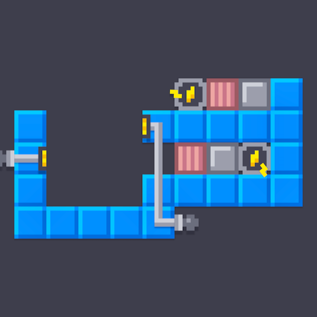

# PowerBoxer

This program solves the puzzle game Power Boxes from [Fancade](https://fancade.com/). The game consists of
gravity-affected blocks that can either be a power source, a conducting block or a non-conducting block, and the goal is
to slide them to the power outlets. If two sources conducts, either by being adjacent or being interconnected by
conducting blocks, they both will go out and become conducting blocks. The solver always finds the solution with the
least amount of moves. If the program reports that no solution is found, it means that is has tried all possible moves
and couldn't find a solution.

## Running

The program is written in Java and runs on Java 16 (or Java 15 with preview features enabled). Compile all sources
using `javac -d build src/*`, enter the directory with `cd build` and run with `java Parser`.

## Usage

Enter the puzzle, row by row, using these characters:

- s for power source
- c for conducting block
- i for isolating block
- o for power outlet (where the power needs to be, not the wall)
- w for wall If an outlet is superpositioned with, lets say a conducting block, use uppercase C.

### Example

  
This puzzle can be entered as

```
     sicw
w  owwwww
wo   icsw
w   wwwww
wwwww
```

...and you end your input with "end". Note how the "o":s are placed on the block where the power needs to come from.
Then, the program finds the solution and lists all the moves as previews and with coordinates, such as:

```
(5,2) -> (4,2)
        #
#   #####
#   ba  #
#   #####
#####    
```

You should always move the piece at position "a" to position "b".

## Licenses

The code is released under an MIT license. The screenshot is from a minigame in the [Fancade](https://fancade.com) app
developed by Martin Magni, and the minigame [Power Boxes](https://fancade.page.link/ZNwg) is made by LukaszM.
